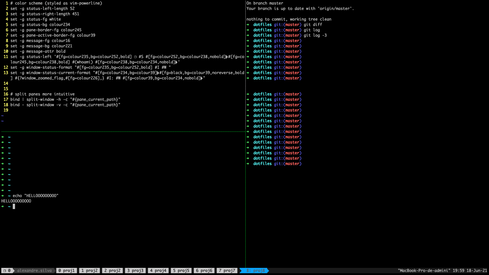

# dotfiles

This repo contains the following dotfiles which I use in order to personalize my work environment and config the main tools I usually use:

## `~/.gitconfig`
Alias and other git configurations

## `~/.bash_profile`
Environment variables and other configurations for my Ubuntu operating system

## `~/.tmux.conf`
Personalization of my tmux tool. Other references to replicate this terminal can be found here:

* https://github.com/tmux/tmux/wiki/Getting-Started

In MacOs, it is also important to download the powerline font here:
* https://github.com/powerline/fonts

## `~/.vimrc`
Vim configurations to personalize my text editor

## `~/.zshrc`
Here I export environment variables and do same configurations using the Z shell

## `~/.aws/config`
If I'm using aws-vault to securely store and access AWS credentials, I use this file to put same configurations

## `~/.ssh/config`
If I'm using cloud machines or GPUs, I use this file to configure the host, hostname and user in order to access the machine easily via terminal
